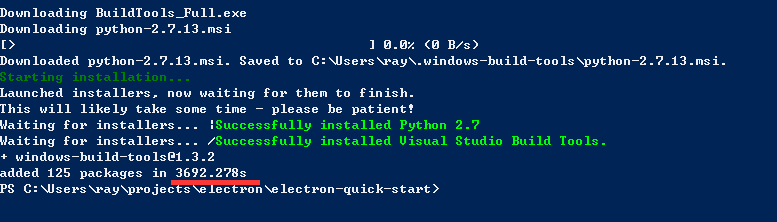
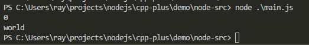

一个超简单的 NodeJS C++ 插件 Demo
====

### 需要先安装 node-gyp， 我才用的方式是：

>  Install all the required tools and configurations using Microsoft's windows-build-tools using npm install --global --production windows-build-tools from an elevated PowerShell or CMD.exe (run as Administrator).

【注意】一定要用管理员模式运行PowerShell或者CMD.exe;我用的是PowerShell。

[node-gyp](https://www.npmjs.com/package/node-gyp)

### 初始化步骤

1.  ```$ npm install --global --production windows-build-tools```这里安装比较耗时 
1.  ```$ npm install -g node-gyp```
1.  ```$ node-gyp configure --debug```
1.  ```$ node-gyp build```
1.  ```$ cd .\node-src```
1.  ```$ node main.js``` 运行结果 

### 参考资料

[nodejs c++插件开发(一) -- 使用vscode 搭建一个c++项目,并调试c++代码](http://www.jianshu.com/p/8a9f4304557c)
